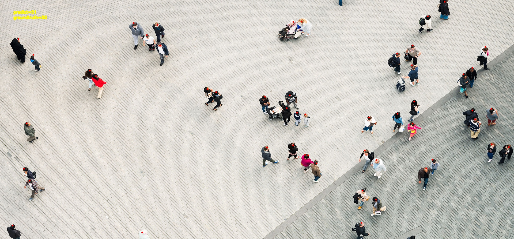
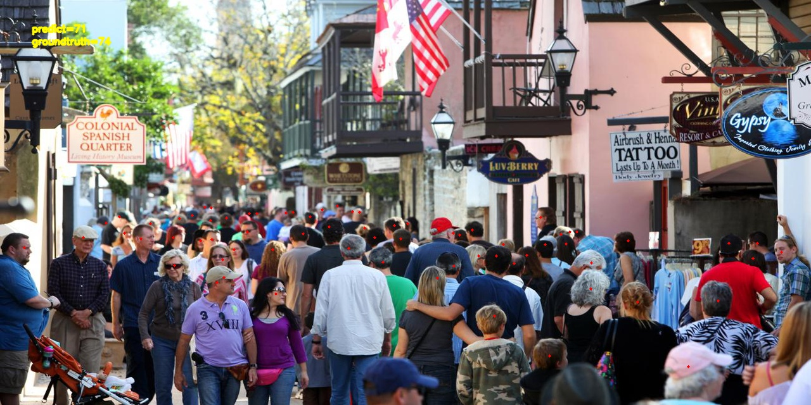
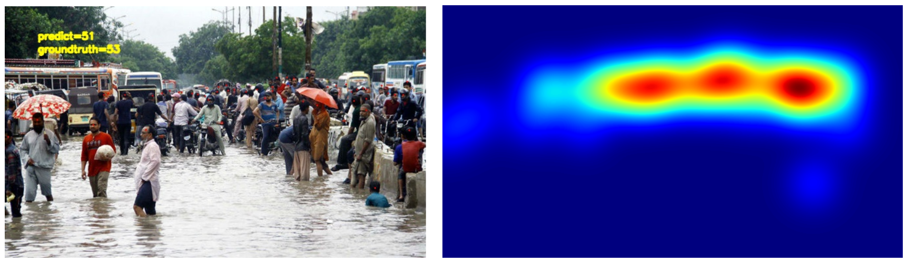

# Crowd Counting and Localization for Surveillance Videos

### Introduction
---
# Crowd Counting and Localization for Surveillance Videos

This project implements a crowd counting method and is heavily inspired by the repository at [CrowdCounting-P2PNet](https://github.com/TencentYoutuResearch/CrowdCounting-P2PNet).

Existing localization-based methods relying on intermediate representations (i.e., density maps or pseudo-boxes) serving as learning targets are counter-intuitive and error-prone. We use a purely point-based framework for joint crowd counting and individual localization. In this framework, instead of merely reporting the absolute counting error at the image level, we use a new metric called density normalized average precision (nAP) to provide a more comprehensive and precise performance evaluation. The overall architecture is built upon the VGG16; it first introduces an upsampling path to obtain a fine-grained feature map. Then it exploits two branches to simultaneously predict a set of point proposals and their confidence scores.

## Preprocessing

The ShanghaiTech dataset needs some preprocessing to be ready for training. Images and ground truth should be prepared in a suitable format. To preprocess the dataset, please run the following commands:

<pre>
python dataset_preparation.py --application='make_list'\
    --list_dir $DATA_DIR \
    --groundtruth_dir  $GT_DIR \
    --images_path $IMG_PATH \
    --groundtruth_txt_path $GT_PATH
</pre>

## Train

To train and fine-tune the model, please run the following commands:

<pre>
python train.py --data_root $DATA_ROOT \
    --dataset_file SHHA \
    --epochs 100 \
    --lr_drop 3500 \
    --output_dir './logs' \
    --checkpoints_dir './logs/checkpoint' \
    --tensorboard_dir './logs' \
    --frozen_weights './pretrained_model/best_mae.pth' \
    --lr 0.00005 \
    --lr_backbone 0.00001 \
    --batch_size 8 \
    --eval_freq 4 \
    --gpu_id 0
</pre>

**data_root** : Train dataset root

**output_dir** : Address to save the weights of the model

**checkpoints_dir** : Address to save the checkpoint

**frozen_weights** : Path to the pre-trained model. If set, only the mask head will be trained.
## Test

A trained model on the MALL_DATASET, SHTechPartA&B, and JHU-CROWD++ datasets is available in the './weights' directory. To predict the locations of individuals in test images, please run the following commands:

<pre>
python test.py --threshold 0.8 \
    --images_path ./test_images \
    --weight_path  ./pretrained_model/best_mae.pth \
    --output_dir ./prediction/images/ \
    --predicts_txt_dir ./prediction/predict_txt.txt \
    --predicts_point_dir ./prediction/new_thr=0.8
</pre>
  
**image_path** : test image folder address

**weight_path** : weights of best model that trained on 3 famous crowd counting dataset: 1- **MALL Dataset** ([Dataset Link](https://personal.ie.cuhk.edu.hk/~ccloy/downloads_mall_dataset.html)) 2- **ShTech Dataset** ([Dataset Link](https://www.dropbox.com/s/fipgjqxl7uj8hd5/ShanghaiTech.zip?dl=0)) 3- **JHU-CROWD++** ([Dataset Link](http://www.crowd-counting.com/))

**output_dir** : predicted images adress

**predicted_txt_dir** : Address of the text file that contains the predicted number of individuals in each image.

## Visualization of Predictions

There are examples of predicting the location of individuals in some test images.

  

  

## Heatmap

To extract the heatmap, please run the following commands:

<pre>
python density_map.py --images_path ./test_images \
    --points_path ./prediction/predict_txt.txt \
    --method  'fixed' \
    --output_dir ./heatmaps 
</pre>

**images_path** : Test image path. 10 test images are uploaded in **./test_images** 

**point_path** : predicted coordinates of individual path

**output_dir** : address to save heatmaps

A sample of the heatmap is provided below:

  

## Crowd Counting on Video

To predict the locations of individuals in a video, please run the following commands:

<pre> 
python video.py --threshold 0.65 \
    --video_path $VIDEO_PATH \
    --weight_path  ./pretrained_model/best_mae.pth \
    --output_dir prediction/video.mp4
</pre>

# Demo Video

[Watch the video](https://github.com/user-attachments/assets/4e5fa214-d044-48ce-ac79-4015e32fee62)

