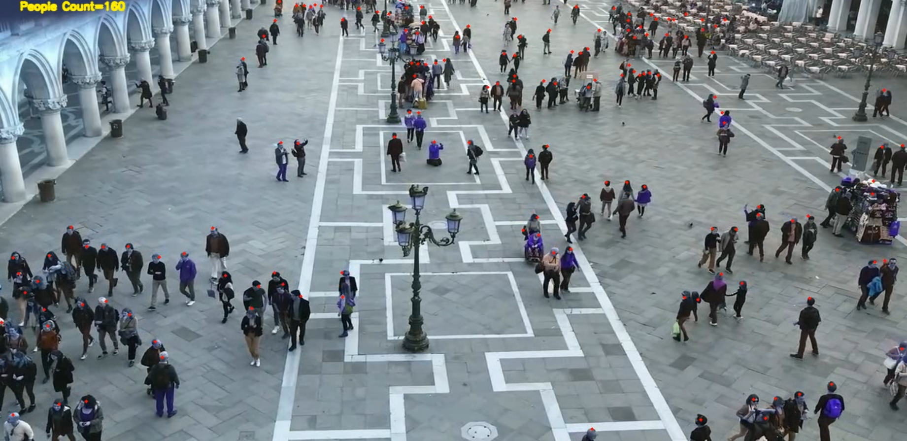

# Crowd Counting and Localization for Surveillance Videos

### Introduction
---
This project implements a crowd counting method and is heavily inspired by the repository at [CrowdCounting-P2PNet](https://github.com/TencentYoutuResearch/CrowdCounting-P2PNet).

Existing localization-based methods relying on intermediate representations (i.e., density maps or pseudo boxes) serving as learning targets are counter-intuitive and error-prone. We use a purely point-based framework for joint crowd counting and individual localization. In this framework, instead of merely reporting the absolute counting error at image level, we use a new metric, called density Normalized Average Precision (nAP), to provide more comprehensive and more precise performance evaluation. The overall architecture Built upon the VGG16, it firstly introduce an upsampling path to obtain fine-grained feature map. Then it exploits two branches to simultaneously predict a set of point proposals and their confidence scores.

## Preprocessing

ShanghaiTech dataset need some preprocessing to ready for train. Images and groundtruths should prepaire to suitable format. To preprocess the dataset, please run the following commands:

<pre>
python dataset_preparation.py --application='make_list'\
    --list_dir $DATA_DIR \
    --groundtruth_dir  $GT_DIR \
    --images_path $IMG_PATH \
    --groundtruth_txt_path $GT_PATH
</pre>

## Test

A trained model on the MALL_DATASET, SHTechPartA&B, and JHU-CROWD++ datasets is available in the './weights' directory. To predict the locations of individuals in test images, please run the following commands:

<pre>
python test.py --threshold 0.8 \
    --images_path ./test_images \
    --weight_path  ./pretrained_model/best_mae.pth \
    --output_dir ./prediction/images/ \
    --predicts_txt_dir ./prediction/predict_txt.txt \
    --predicts_point_dir ./prediction/new_thr=0.8
</pre>
  
**image_path** : test image folder address

**weight_path** : weights of best model that trained on 3 famous crowd counting dataset: 1- **MALL Dataset** ([Dataset Link](https://personal.ie.cuhk.edu.hk/~ccloy/downloads_mall_dataset.html)) 2- **ShTech Dataset** ([Dataset Link](https://www.dropbox.com/s/fipgjqxl7uj8hd5/ShanghaiTech.zip?dl=0)) 3- **JHU-CROWD++** ([Dataset Link](http://www.crowd-counting.com/))

**output_dir** : predicted images adress

**predicted_txt_dir** : address of the text file that contains predicted nubmer of person in each image.

## Visualization of Predictions

There are sampels of predicting location of individuals in some test images.

  

  

## Heatmap

To extract heatmap, please run the following commands:

<pre>
python density_map.py --images_path ./test_images \
    --points_path ./prediction/predict_txt.txt \
    --method  'fixed' \
    --output_dir ./heatmaps 
</pre>

**images_path** : Test images path. 10 test images upload in **./test_images** 

**point_path** : predicted coordinates of individual path

**output_dir** : address to save  heatmaps

A sample of heatmap is provided in below:

  

## Crowd Counting on Video

To predict the locations of individuals in a video, please run the following commands:

<pre> 
python video.py --threshold 0.65 \
    --video_path $VIDEO_PATH \
    --weight_path  ./pretrained_model/best_mae.pth \
    --output_dir prediction/video.mp4
</pre>

# Demo Video
> [**YouTube Link**](https://youtu.be/fyVCOq6zjss)
> 

