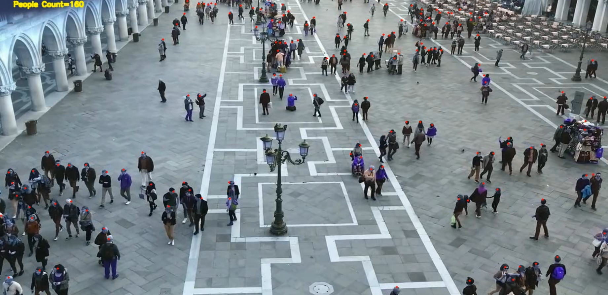

# Crowd Counting and Localization for Surveillance Videos

### Introduction
---
This project implements a crowd counting method and is heavily inspired by the repository at [CrowdCounting-P2PNet](https://github.com/TencentYoutuResearch/CrowdCounting-P2PNet).

The overall architecture of the P2PNet. Built upon the VGG16, it firstly introduce an upsampling path to obtain fine-grained feature map. Then it exploits two branches to simultaneously predict a set of point proposals and their confidence scores.

## Test

## Visualized demos

Backbone weights(vgg16) is so big(540MB), It is not uploaded on the Github and you have to download it with the following code
> !wget https://download.pytorch.org/models/vgg16_bn-6c64b313.pth

## Demo Video
> [**Youtube Link**](https://youtu.be/fyVCOq6zjss)
> 

